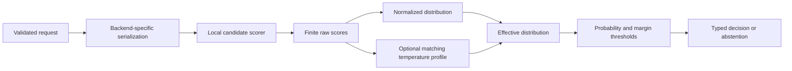

# Architecture

`DecisionModel` owns input validation, the inference lock, normalization, profile
identity checks, and output validation. A backend owns tokenization, device choice,
model loading, and raw scores. FastAPI holds one model instance for the process.
The TypeScript client calls its HTTP endpoints; Python can work entirely in process.

State may be text, a record, or a list of texts; `render_state` turns it into
deterministic text once per request before any backend sees it. A choice may carry a
description, a `not_for` boundary and examples; `candidate_texts` is what the model
reads and `labels` is what results are keyed by.

Each request has at least two unique nonblank choices. A rubric `score` is a choice
over 2–10 ordered level descriptions whose distribution is re-keyed by level index
and summarized as its expectation. Batches flatten all candidate
pairs and process them in bounded microbatches. Booleans and `multi_label` labels are
statements about the state: an NLI backend scores each statement directly and returns
entailment, neutral, and contradiction logits (`StatementBackend`); the neutral share
becomes `unsupported`. Other backends score each statement as a two-way choice.
`decide_many` repeats the shared state per question; there is no shared encoder
cache in the alpha.

Weights load lazily from pinned local cache entries. Explicit `pull` is the only
default model download operation. The server ensures loading during startup.
Loading uses safetensors and disables custom remote code. Optional heavyweight
dependencies are imported only by their corresponding functionality.

For long inputs, the scorer preserves the full question and choice and truncates
the state prefix to the selected token budget. It reports the truncation in metadata
and emits a warning. If question and choice leave insufficient state capacity,
the request fails instead of silently changing the choice. Applications needing
tail facts should summarize or chunk explicitly; prefix truncation loses tail facts.

One `DecisionModel` serializes its model operations through a lock. Concurrent HTTP
requests are admitted through a bounded gate and inference runs in a worker thread.
This avoids blocking the event loop and uncontrolled device memory growth; it does
not imply parallel GPU execution. Explicit batch endpoints improve utilization.
Cross-request dynamic batching is future work.

`latency_ms` on each result is the elapsed scoring batch wall time including lock
wait, shared by every result in that batch. It is not a per-item latency estimate.
The benchmark measures its own request wall time and labels amortized throughput
separately. Model loading, Python scoring, HTTP, and remote API observations are
distinct timing scopes.
